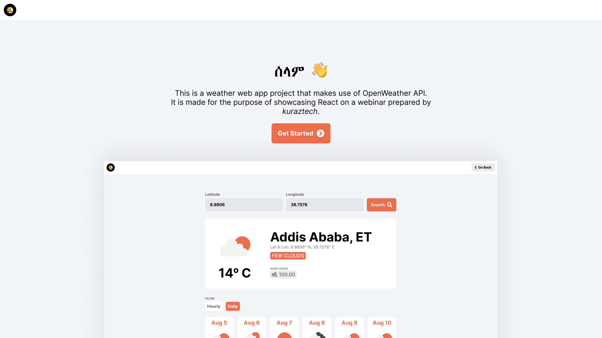
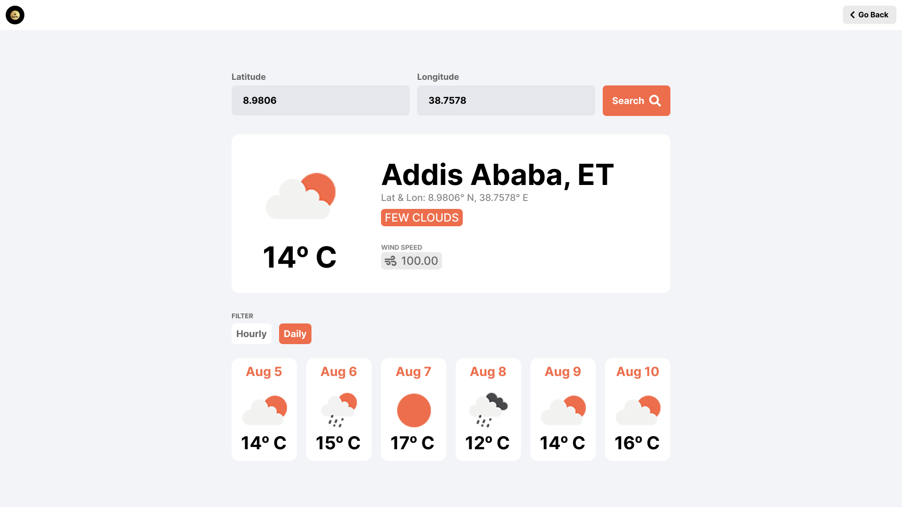
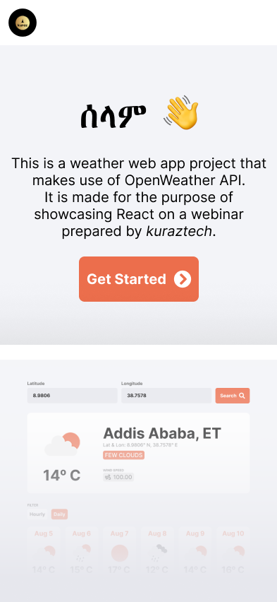
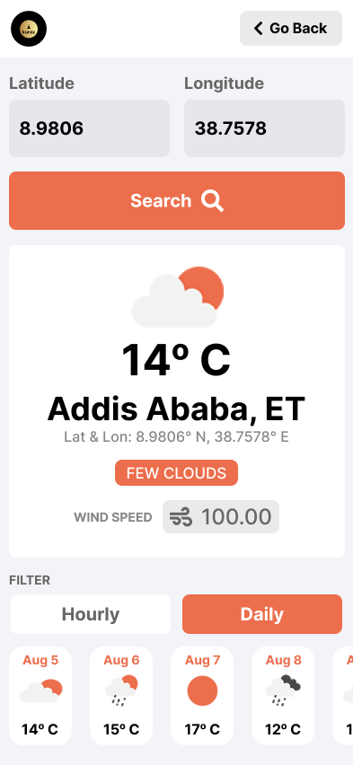

# About this project
This is a weather web app project made for the purpose of explaining React on a webinar prepared by [Kuraztech][kuraztech].
This project makes use of [OpenWeather][OpenWeather] API. 
>[!NOTE]
>Make sure you create an OpenWeather account and obtain a free API key. 

## License
[](http://creativecommons.org/licenses/by/4.0/)

This work is licensed under a <a rel="license" href="http://creativecommons.org/licenses/by/4.0/">Creative Commons Attribution 4.0 International License</a>.

# How to run this project
* Clone this project to your directory
* Open terminal inside the project directory
* Create .env file and put your OpenWeather API key as: ```OPENWEATHERMAP_API_KEY="PUT_YOUR_API_KEY_HERE"```
* Run the following command ```yarn run dev``` or ```npm run dev```

# Tools
The following packages are pre-installed with the starter project:
* tailwindcss
* Axios
* React Router Dom 
* dotenv
* Font Awesome

# UI Reference

**1. Welcome Screen**



**2. Search Result**



**3. Mobile Views**





Prepared By: [Yeabsira Getahun][portfolio] via [Kuraz Technologies][kuraztech].

[kuraztech]: https://www.kuraztech.com
[openWeather]: https://openweathermap.org
[portfolio]: https://yeab5ira.github.io